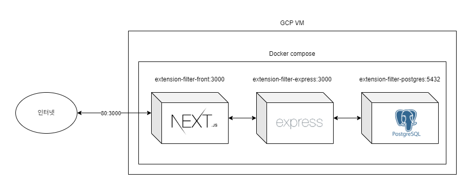

# 파일 확장자 차단 설정
> http://34.47.86.206/
---
### 요구사항
- 파일 확장자 차단 설정 화면 구현
  - 고정 확장자 섹션
    - 체크박스
  - 커스텀 확장자 섹션
      - 확장자명 input
      - 커스텀 확장자 추가 버튼
      - 커스텀 확장자 목록
      - 커스텀 확장자 삭제 버튼
      - 커스텀 확장자 개수/최대개수 라벨
- 커스텀 확장자 input value 최대 길이 20자
- 커스텀 확장자 최대 개수 200개

### 추가 구현 사항
- 중복 체크
- 확장자명 최대 길이/개수 변수화
  - MAX_CUSTOM_EXTENSION_CNT
  - MAX_CUSTOM_EXTENSION_LENGTH
- input 값에 따른 유효성 검사 메시지 노출
  - 고정 확장자로 등록된 확장자입니다. 상단에서 차단 여부를 체크해주세요.
  - 커스텀 확장자는 최대 ${MAX_CUSTOM_EXTENSION_CNT}개까지 가능합니다.
  - 확장자명은 알파벳(a-z) 혹은 숫자로 끝나야 합니다.
  - 확장자명은 알파벳(a-z) 혹은 숫자로 시작하여야 합니다.
  - 알파벳(a-z), 숫자, 점(.)만 입력 가능합니다.
  - 점(.)은 연속으로 입력할 수 없습니다.
  - 최대 ${MAX_CUSTOM_EXTENSION_LENGTH}자까지 입력 가능합니다.
- 초기화 기능
  - 등록한 확장자가 있을때만 초기화 버튼 노출
---
### 기술 스택
- Frontend : Next.js, Tailwind
- Backend: Express.js, TypeORM
- DBMS : PostgreSQL
- Deployment : GCP VM, Docker
### 아키텍쳐

---
### 주요 파일 정보
##### 백엔드
- [익스프레스 API](https://github.com/yooputer/extension-filter/blob/master/extension-filter-express/src/controller/extension-filter.ts)
- [테이블 Entity](https://github.com/yooputer/extension-filter/blob/master/extension-filter-express/src/entity/FilteredExtension.ts)
- [확장자명 유효성 검사 함수](https://github.com/yooputer/extension-filter/blob/master/extension-filter-express/src/lib/extension.ts)
##### 프론트엔드
- [메인 페이지 컴포넌트](https://github.com/yooputer/extension-filter/blob/master/extension-filter-nextjs/src/app/page.tsx)
- [고정확장자 섹션 컴포넌트](https://github.com/yooputer/extension-filter/blob/master/extension-filter-nextjs/src/app/components/FixedExtensionSection.tsx)
- [커스텀 확장자 섹션 컴포넌트](https://github.com/yooputer/extension-filter/blob/master/extension-filter-nextjs/src/app/components/CustomExtensionSection.tsx)
- [커스텀 훅](https://github.com/yooputer/extension-filter/blob/master/extension-filter-nextjs/src/context/FilteredExtensionContext.tsx)
##### 배포
- [백엔드 Dockerfile](https://github.com/yooputer/extension-filter/blob/master/extension-filter-express/Dockerfile)
- [프론트 Dockerfile](https://github.com/yooputer/extension-filter/blob/master/extension-filter-nextjs/Dockerfile)
- [디비 Dockerfile](https://github.com/yooputer/extension-filter/blob/master/extension-filter-postgres/Dockerfile)
- [도커 컴포즈](https://github.com/yooputer/extension-filter/blob/master/docker-compose.yml)

---
### 배포 프로세스
1. 로컬에서 [docker-build.sh](https://github.com/yooputer/extension-filter/blob/master/docker-build.sh)를 사용하여 이미지 빌드 후 도커 허브에 푸시
2. 원격 서버에서 [docker-compose.yml](https://github.com/yooputer/extension-filter/blob/master/docker-compose.yml)로 docker compose 실행 

---
##### 고도화
- [ ] 로딩중 처리
- [ ] 와일드카드 표현식 사용
- [ ] 테스트 버튼 구현
- [ ] 로그 기록